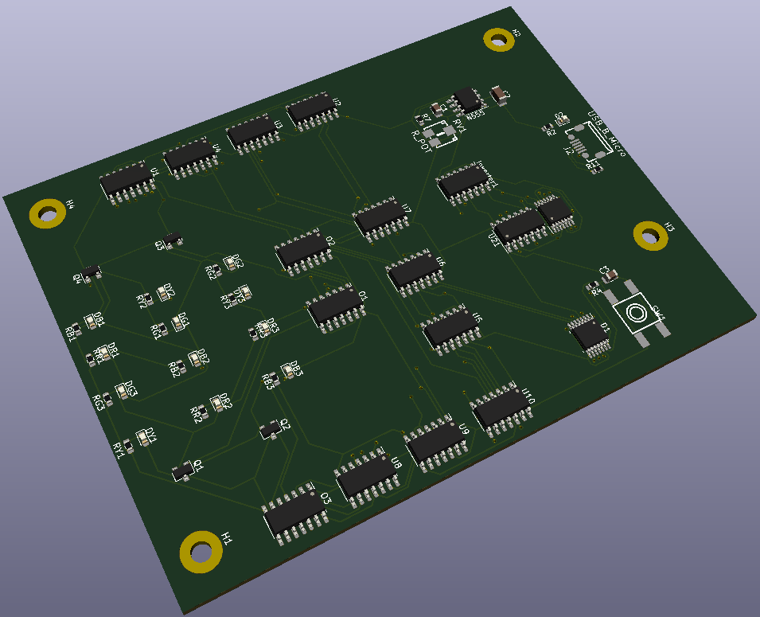

# Christmas lights using 3x4 Led Array and Mealy FSM

The board consits of 4 different LED colours. Each color is represented by 3 standalone LEDs.
When under power from Micro-USB, the LEDs have 4 modes in which they light up (LEDs are blinking).
By pressing the button on board, you can change the mode in which the LEDs are blinking.
Each mode changes the order in which the LEDs light are blinking, the composition and which LEDs light up.
Also, the speed of blinking can be modified by using potentiometer.

